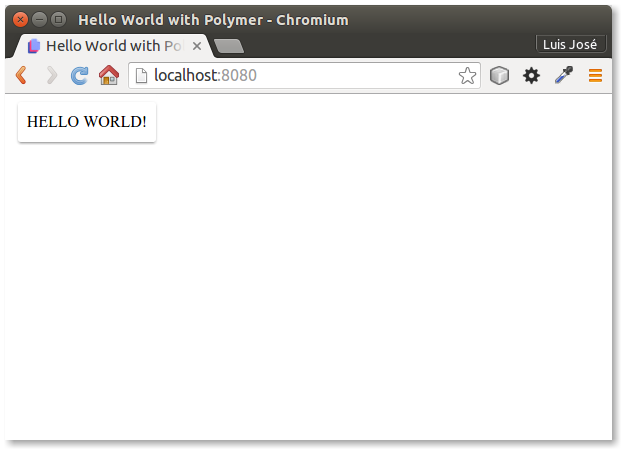

# Polymer Hello World tutorial

Table of contents
=================

  * [Polymer installation](#polymer-installation)
    * [Install NodeJS](#install-nodejs)
    * [Update `npm`](#update-npm)
    * [Install Bower](#install-bower)
    * [Create project folder](#create-project-folder)
    * [Create `bower.json` file](#create-bower.json-file)
    * [Install Polymer](#install-polymer)
  * [Install `paper-button`](#install-paper-button)
  * [Set up a web server](#set-up-a-web-server)
  * [Create `index.html`](#create-index.html)
    
    

## Polymer installation

This installation has been tested successfully in **Ubuntu 15.10**

### Install NodeJS

Add NodeJS to the repositories and install:

```console
curl -sL https://deb.nodesource.com/setup_5.x | sudo -E bash -
sudo apt-get install -y nodejs
```

Check the installation:

```console
node -v
```

### Update `npm`

```console
sudo npm install npm -g
```

Check the installation:

```console
npm -v
```

### Install Bower

```console
sudo npm install -g bower
```

Check the installation:

```console
bower -v
```

### Create project folder

```console
mkdir PolymerHello
cd PolymerHello
```

### Create `bower.json` file

```console
bower init
```

### Install Polymer

```console
bower install --save Polymer/polymer
```

## Install `paper-button`

**Paper Elements** are **Material Desing** elements.

```console
bower install --save PolymerElements/paper-button
```

## Set up a web server

```console
python -m SimpleHTTPServer 8080
```

## Create `index.html`

Create `index.html` file with this content:

```html
<!DOCTYPE html>
<html lang="en">
<head>
  <meta charset="UTF-8">
  <title>Hello World with Polymer</title>
  <script src="bower_components/webcomponentsjs/webcomponents.js"></script>
  <link rel="import" href="bower_components/paper-button/paper-button.html">
</head>
<body>
  <paper-button raised> Hello World! </paper-button>
</body>
</html>
```

## Test the page

Go to <http://localhost:8080/>




