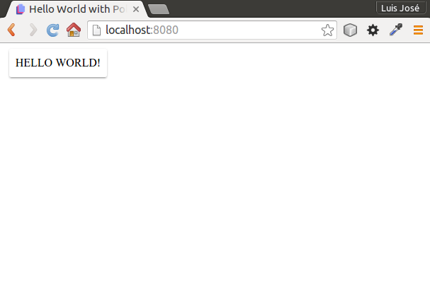

# Polymer Hello World tutorial

Table of contents
=================

  * [Polymer installation](#polymer-installation)
    * [Install NodeJS](#install-nodejs)
    * [Update `npm`](#update-npm)
    * [Install Bower](#install-bower)
    * [Create project folder](#create-project-folder)

## Polymer installation

This installation has been tested successfully in **Ubuntu 15.10**

### Install NodeJS

Add NodeJS to the repositories and install:

```console
curl -sL https://deb.nodesource.com/setup_5.x | sudo -E bash -
sudo apt-get install -y nodejs
```

Check the installation:

```console
node -v
```

### Update `npm`

```console
sudo npm install npm -g
```

Check the installation:

```console
npm -v
```

### Install Bower

```console
sudo npm install -g bower
```

Check the installation:

```console
bower -v
```

### Create project folder

```console
mkdir PolymerHello
cd Polymer
```


%%### Go to your site!

%%¡Congratulations! You have your Drupal 8 site installed in <http://localhost/mydrupal8/>.

%%


